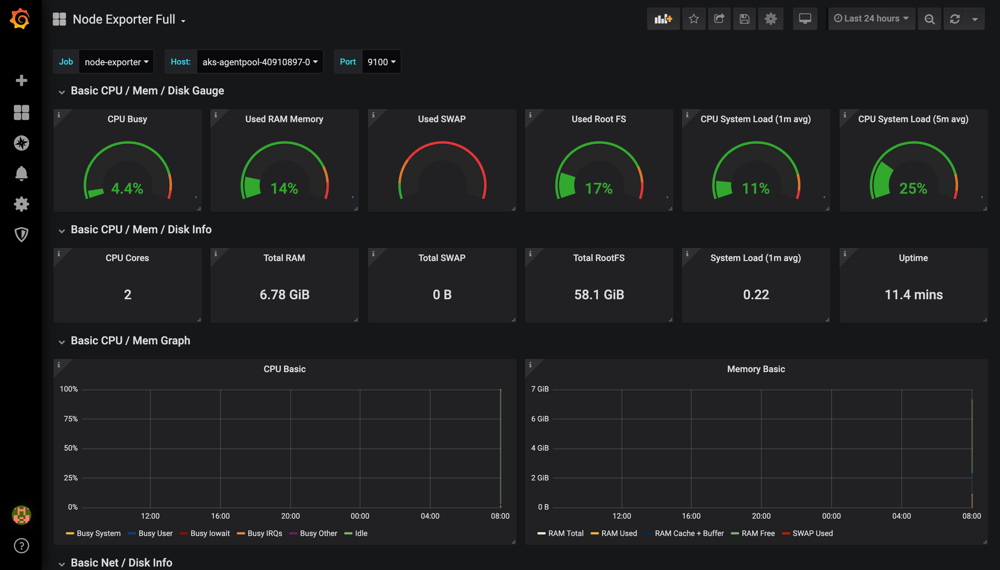

# Azure Hipster Shop: AKS Microservices Demo

## 6. Installing Prometheus and Grafana using Helm

### Installing Tiller, Kubernetes component of Helm

You already installed the Helm local client in the Prerequisites step. But now that you have the Kubernetes cluster set up and kubectl configured to talk to it, we need also to install the cluster's component, called Tiller. [More info here](https://helm.sh/docs/using_helm/#installing-tiller).

To install Tiller in the current Kubernetes cluster configured with kubectl, use:

```
helm init --history-max 200
```

It is a good practice to limit the history maximum number of items, as it can consume a big amount of space.


To check that Tiller pod is up and running use:

```
$kubectl get pods --namespace kube-system

NAME                                    READY   STATUS    RESTARTS   AGE
coredns-696c4d987c-d4ssp                1/1     Running   0          2d9h
coredns-696c4d987c-wmwwj                1/1     Running   0          2d9h
coredns-autoscaler-657d77ffbf-tj7vf     1/1     Running   0          2d9h
kube-proxy-9kxnv                        1/1     Running   0          2d9h
kubernetes-dashboard-66d756f947-jft28   1/1     Running   0          2d9h
metrics-server-58699455bc-wvrjb         1/1     Running   0          2d9h
tiller-deploy-57f498469-prsfg           1/1     Running   0          58s
tunnelfront-6f4cb4755b-wjfvw            1/1     Running   0          2d9h
```

### Installing prometheus-operator Helm chart

Helm uses a packaging format called *charts*. A chart is a collection of files that describe a related set of Kubernetes resources. The default location for Helm charts are their GitHub repository at:
https://github.com/helm/charts.git

You can update the list of charts available using:
```
helm repo up
```

To search for a chart, you can use the search command:
```
helm search stable/prometheus-operator --versions --version=">=6" --col-width=30
```
We are going to install the prometheus-operator Helm chart. It is a complex packages that is beyond the scope of what we can explain here, read [its documentation for more information](https://github.com/coreos/prometheus-operator). Let's summarize that is includes Prometheus to gather cluster's metrics, Grafana to display a dashboard of those metrics, PrometheusRule to define alerting and recording rules, and Alertmanager 

If you just installed Tiller, wait a few seconds, and then install the prometheus-operator Helm chart, with the name __prometheus__ in a namespace named __monitoring__. 

```
helm install --namespace monitoring --name prometheus stable/prometheus-operator --set rbac.create=true
```

We need to specify the _rbac.create=true_ variable for it to work in Azure, because it uses role-based access control (RBAC) to limit access to cluster resources.

To check Prometheus' pods in the monitoring namespace use:

```
$ kubectl get pods --namespace monitoring
NAME                                                     READY   STATUS    RESTARTS   AGE
alertmanager-prometheus-prometheus-oper-alertmanager-0   2/2     Running   0          3m32s
prometheus-grafana-b4fb4d64d-j95b4                       2/2     Running   0          4m2s
prometheus-kube-state-metrics-6fc57fc485-tjb8s           1/1     Running   0          4m2s
prometheus-prometheus-node-exporter-6f6l4                1/1     Running   0          4m2s
prometheus-prometheus-oper-operator-cc4dfd77c-v5wsr      1/1     Running   0          4m2s
prometheus-prometheus-prometheus-oper-prometheus-0       0/3     Pending   0          3m26s
```

### Accessing Prometheus web console

If you want to access Prometheus web console, we have to get its pod's name first:

```
export POD_NAME=$(kubectl get pods --namespace monitoring -l "app=prometheus" -o jsonpath="{.items[0].metadata.name}")
```

Then we can open a proxy to it:
```
kubectl --namespace monitoring port-forward $POD_NAME 9090
```

And visit http://localhost:9090

### Accessing Grafana's dashboard and setting it up

Now we are going to set up Grafana.

To know the password for login into Grafana, use:
```
kubectl get secret \
    --namespace monitoring prometheus-grafana \
    -o jsonpath="{.data.admin-password}" \
    | base64 --decode ; echo
```

We need to get Grafana pod name: 

```
export NODE_GRAF=$(kubectl get pods --namespace monitoring -l "app=grafana,release=prometheus" -o jsonpath="{.items[0].metadata.name}")
```

Now we open a proxy to Grafana's  dashboard, and use __admin__ username and the previous password to log in.
```
$ kubectl --namespace monitoring port-forward $NODE_GRAF 3000
```

And visit http://localhost:3000

We need to define a dashboard for Grafana to represent Prometheus metrics. You can browse Grafana dashboards definitions at https://grafana.com/dashboards. We will use https://grafana.com/grafana/dashboards/1860.

Click import, load dashboard definition id _1860_, and select Prometheus as the data source.

You should see the dashboard's instant metrics right away, and graphs will slowly start to display historical values.




_Improvement_: You can modify the prometheus-operator Helm chart to automatically deploy the Grafana dashboard configured. See [this tutorial](https://medium.com/@chris_linguine/how-to-monitor-your-kubernetes-cluster-with-prometheus-and-grafana-2d5704187fc8).

_Improvement_: Check [this alternative](http://www.allaboutwindowssl.com/2019/03/setup-prometheus-grafana-monitoring-on-azure-kubernetes-cluster-aks/
) to make Grafana use a random password on deployment.

_Improvement_: Describe creating users in Grafana, binding the output to the public IP, and using a persistent storage.

---
[Next step: 7. Terminate and free resources](../docs/98_free_resources.md)  

[Previous step: 5. Create cluster with Skaffold](../docs/05_cluster_skaffold.md)

